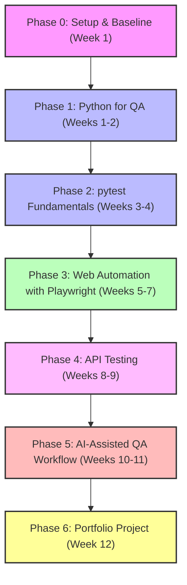

# QA + AI Automation Study Plan

For: a junior functional QA engineer with little or no programming experience.

Goal: become employable as a **Junior QA Automation Engineer with AI-assisted testing skills**.

The aim is not to turn her into a full software engineer first. The aim is to help her automate realistic QA work, understand the code she runs, use AI responsibly, and build a small portfolio that proves it.

## Target Role

Use this target title when choosing what to study:

**Junior QA Automation Engineer / QA Engineer with Automation and AI-assisted Testing**

Avoid making "AI engineer" the first goal. That path is too broad and too programming-heavy. Her existing QA experience is an advantage, so the plan should build from manual testing into automation.

### 🗺️ 12-Week Roadmap Overview



## Core Stack

Keep the first stack small:

- **Python** for beginner-friendly programming.
- **pytest** for writing and running tests.
- **Playwright for Python** for browser automation.
- **Postman** for API exploration and testing.
- **Git and GitHub** for portfolio, version control, and collaboration basics.
- **AI assistant** for explanations, first drafts, debugging help, test ideas, and code review.

Useful official references:

- Python: https://docs.python.org/3/tutorial/
- pytest: https://docs.pytest.org/en/stable/getting-started.html
- Playwright Python: https://playwright.dev/python/docs/intro
- Playwright codegen: https://playwright.dev/python/docs/codegen
- Postman docs: https://learning.postman.com/docs/getting-started/overview/
- ISTQB AI Testing: https://istqb.org/certifications/certified-tester-ai-testing-ct-ai/

## Guiding Rules

> [!IMPORTANT]
> **1. Context is Key:** Learn programming through QA examples, not abstract exercises.
> **2. Tangible Results:** Keep each week focused on one visible outcome.
> **3. Hands-on Learning:** She should type the code herself, even when AI generates a draft.
> **4. Comprehension over Copying:** She must be able to explain every line before saving it to the portfolio.
> **5. Embrace Failure:** Errors are part of the training. Reading errors is a core skill.
> **6. Strict Focus:** Do not chase every tool. Python, pytest, Playwright, Postman, Git, and AI are enough for the first phase.

## Weekly Rhythm

Recommended pace:

- 2 mentor sessions per week, 60-90 minutes each.
- 2 solo practice sessions per week, 30-60 minutes each.
- 1 visible deliverable every week.

Mentor session format:

1. Pick one small goal.
2. Ask her to explain the expected behavior in plain English.
3. Let her type and run the code.
4. When it fails, ask: "What do you think this error means?"
5. Help her debug only after she has made a first guess.
6. End by having her explain what changed and why.

## Phase 0: Setup and Baseline

Duration: 1 week.

Goal: set up tools and get the first tiny tests running.

Install:

- Python 3
- VS Code
- Git
- GitHub account
- Postman
- Playwright dependencies

Commands to learn:

```bash
python --version
python -m venv .venv
source .venv/bin/activate
pip install pytest
pytest
git status
git add .
git commit -m "Add first tests"
```

First deliverable:

- Create a GitHub repo called `qa-automation-portfolio`.
- Add a `README.md`.
- Add one file called `test_basics.py`.
- Write and run 3 passing tests.

Example:

```python
def test_total_price():
    price = 10
    tax = 2

    assert price + tax == 12


def test_user_is_active():
    user = {"name": "Ana", "active": True}

    assert user["active"] is True


def test_error_message():
    message = "Invalid password"

    assert message == "Invalid password"
```

Definition of done:

- She can run `pytest`.
- She can explain what `assert` does.
- She has pushed her first commit to GitHub.

## Phase 1: Python for QA

Duration: weeks 1-2.

Goal: learn only the Python needed to write simple tests.

Topics:

- variables
- strings
- numbers
- booleans
- lists
- dictionaries
- `if` statements
- loops
- functions
- reading simple JSON-like data
- assertions
- error messages

Exercises:

- Validate a login error message.
- Check that a user has the expected role.
- Check that a shopping cart total is correct.
- Check that a required field error appears.
- Check that a list contains a specific item.

Example:

```python
def is_valid_email(email):
    return "@" in email and "." in email


def test_valid_email():
    assert is_valid_email("person@example.com") is True


def test_invalid_email():
    assert is_valid_email("person-example.com") is False
```

AI practice:

- Ask AI: "Explain this Python test like I am new to programming."
- Ask AI: "Give me 5 edge cases for testing email validation."
- Ask AI: "Why is this assertion failing?"

Do not study yet:

- algorithms
- object-oriented programming in depth
- decorators
- advanced data structures
- full backend development

Definition of done:

- She can write a small function.
- She can write 2-3 tests for that function.
- She can read a basic pytest failure.

## Phase 2: pytest Fundamentals

Duration: weeks 3-4.

Goal: understand test structure and automated test execution.

Topics:

- test file naming
- test function naming
- arrange, act, assert
- positive and negative tests
- grouping tests
- parametrized tests
- fixtures at a basic level
- running one test vs all tests

Commands:

```bash
pytest
pytest -v
pytest test_file.py
pytest test_file.py::test_name
```

Exercises:

- Test password rules.
- Test form validation.
- Test cart totals.
- Test user permissions.
- Test status transitions such as `draft`, `submitted`, `approved`, `rejected`.

Example:

```python
import pytest


@pytest.mark.parametrize(
    "password, expected",
    [
        ("short", False),
        ("longenough", True),
        ("", False),
    ],
)
def test_password_length(password, expected):
    assert (len(password) >= 8) is expected
```

AI practice:

- Ask AI to generate edge cases.
- Ask AI to explain failed assertions.
- Ask AI to refactor duplicate tests.
- Ask AI to review whether test names are clear.

Definition of done:

- She has at least 15 pytest tests in GitHub.
- She understands why each test exists.
- She can run a single failing test and fix it.

## Phase 3: Web Automation With Playwright

Duration: weeks 5-7.

Goal: automate real browser workflows.

Topics:

- opening a page
- clicking buttons
- filling fields
- checking text
- locators
- assertions
- waiting
- screenshots and traces
- why UI tests become flaky

Start with Playwright codegen:

```bash
pip install pytest-playwright
playwright install
playwright codegen https://demo.playwright.dev/todomvc
```

Exercises:

- Add a todo item.
- Mark a todo item completed.
- Delete a todo item.
- Filter active and completed items.
- Check validation messages in a sample form.

Good automation habits:

- Prefer user-facing locators like role, label, text, and test IDs.
- Keep tests short.
- Test one behavior at a time.
- Avoid sleep-based waiting.
- Name tests clearly.

Example test shape:

```python
def test_add_todo(page):
    page.goto("https://demo.playwright.dev/todomvc")

    page.get_by_placeholder("What needs to be done?").fill("Learn Playwright")
    page.keyboard.press("Enter")

    assert page.get_by_text("Learn Playwright").is_visible()
```

AI practice:

- Record a test with codegen.
- Ask AI: "Clean this Playwright test and explain each change."
- Ask AI: "Make this selector more reliable."
- Ask AI: "Why might this test be flaky?"

Definition of done:

- She has 5-8 browser tests.
- She can explain what a locator is.
- She can fix a broken selector with help.
- She knows the difference between a good test and a fragile recorded script.

## Phase 4: API Testing

Duration: weeks 8-9.

Goal: understand APIs well enough to test them in Postman and Python.

Topics:

- HTTP basics
- GET, POST, PUT, PATCH, DELETE
- status codes
- request body
- response body
- JSON
- headers
- basic authentication concepts
- API assertions

Start in Postman:

- Send a GET request.
- Inspect status code.
- Inspect JSON response.
- Add simple Postman tests.
- Save requests in a collection.

Then repeat simple checks in Python.

Example:

```python
import requests


def test_get_post():
    response = requests.get("https://jsonplaceholder.typicode.com/posts/1")

    assert response.status_code == 200
    assert response.json()["id"] == 1
```

AI practice:

- Ask AI to explain a JSON response.
- Ask AI to suggest API test cases.
- Ask AI to turn a manual API check into a pytest test.
- Ask AI to explain status codes.

Definition of done:

- She has a Postman collection with basic tests.
- She has 5 API tests in Python.
- She understands status code, request, response, and JSON.

## Interlude: Real-Ticket Simulation

Run alongside Phases 2-4.

Skills are not enough to be the best junior. Independence is. From Phase 2
onward, have her work the tickets in [`tickets/`](tickets/) — each is a
Jira-style brief she carries end-to-end: branch, write the test, open a pull
request, and respond to your review comments.

This is the single highest-leverage habit in the whole plan. A junior who can
take a ticket and reach a merged PR without help is worth more than one who
writes fancier code but needs hand-holding. See [`tickets/README.md`](tickets/README.md)
for the loop and [`tickets/MENTOR-REVIEW.md`](tickets/MENTOR-REVIEW.md) for how to review like a real colleague.

## Phase 5: AI-Assisted QA Workflow

Duration: weeks 10-11.

Goal: use AI like a QA automation assistant, not like a magic answer machine.

Practical AI uses:

- turn user stories into test scenarios
- generate boundary cases
- improve bug reports
- summarize test failures
- explain unfamiliar code
- draft automation tests
- review test naming
- suggest missing coverage

Prompt templates:

```text
You are helping me as a QA mentor. Explain this test failure in beginner-friendly language. Then give me 3 possible fixes. Do not rewrite the whole file yet.
```

```text
Given this user story, create functional test scenarios, edge cases, and negative tests. Format them as a QA test matrix.
```

```text
Review this Playwright test for flakiness. Explain which selectors or waits are risky and suggest improvements.
```

```text
Convert this manual test case into a pytest + Playwright test skeleton. Keep the code simple enough for a beginner to understand.
```

Rules for responsible AI use:

- Never paste secrets, passwords, tokens, customer data, or private company data.
- Do not commit code she cannot explain.
- Use AI to learn and accelerate, not to bypass understanding.
- Always run generated tests locally.
- Ask AI for explanations, not only finished code.

Definition of done:

- She can use AI to create test ideas.
- She can use AI to debug one failure.
- She can explain how AI helped and what she verified herself.

## Phase 6: Portfolio Project

Duration: week 12.

Goal: create one complete portfolio project that looks credible to hiring managers.

Repository:

`qa-automation-portfolio`

Suggested structure:

```text
qa-automation-portfolio/
  README.md
  requirements.txt
  tests/
    test_python_basics.py
    test_api.py
    test_ui_todos.py
  postman/
    api-testing-collection.json
  docs/
    test-plan.md
    ai-assisted-testing-notes.md
```

README should include:

- what the project tests
- tools used
- how to install
- how to run tests
- example test output
- what she learned
- how AI was used responsibly

Portfolio checklist:

- 15+ Python/pytest tests
- 5+ API tests
- 5+ Playwright UI tests
- 1 Postman collection
- 1 test plan document
- 1 short AI-assisted testing note
- clean README
- GitHub commits over time, not one giant upload

Definition of done:

- A recruiter or hiring manager can open the repo and understand what she can do.
- She can run the project from scratch.
- She can explain the project in 3 minutes.

## Optional Phase 7: Job Readiness

Duration: weeks 13-16.

Goal: prepare for interviews and real team work.

Topics:

- testing pyramid
- smoke vs regression tests
- exploratory testing
- bug reports
- CI basics with GitHub Actions
- test data
- flaky test investigation
- page object model basics
- basic SQL for QA

Interview practice:

- Explain the difference between manual and automated testing.
- Explain when not to automate a test.
- Explain what makes a UI test flaky.
- Explain how to test an API.
- Explain how she uses AI responsibly.
- Walk through one portfolio test.

Possible next certifications:

- ISTQB Foundation, if she does not already have it.
- ISTQB AI Testing later, after she has hands-on automation basics.

## First Month Detailed Plan

### Week 1: First Tests

Goal:

- Make programming feel less scary.
- Run first pytest tests.

Tasks:

- Install Python, VS Code, Git, pytest.
- Create GitHub repo.
- Write 3-5 simple tests.
- Practice reading one failing assertion.

Mentor focus:

- Explain `assert`.
- Explain terminal basics.
- Help her push to GitHub.

Deliverable:

- `test_basics.py` with 3-5 passing tests.

### Week 2: Python Basics for QA

Goal:

- Use basic Python data structures for test data.

Tasks:

- Practice strings, booleans, lists, dictionaries.
- Write tests around users, form fields, and cart totals.
- Create one intentional failure and fix it.

Mentor focus:

- Ask her to predict test results before running.
- Ask her to explain error messages.

Deliverable:

- 8-10 total tests in the repo.

### Week 3: Better pytest Tests

Goal:

- Write clearer and less repetitive tests.

Tasks:

- Learn test names.
- Learn arrange, act, assert.
- Learn parametrized tests.
- Test password validation or form validation.

Mentor focus:

- Improve test names.
- Explain why good tests are readable.

Deliverable:

- 15+ total tests, including parametrized tests.

### Week 4: Mini QA Test Suite

Goal:

- Build confidence with a small test suite.

Tasks:

- Choose one small domain: login, cart, user roles, or form validation.
- Write positive, negative, and edge-case tests.
- Add a README section explaining how to run tests.

Mentor focus:

- Help her think like a tester and an automator.
- Show how manual test cases become automated checks.

Deliverable:

- A small but clean pytest suite and a clear README.

## Suggested Mentor Questions

Use these often:

- What behavior are we testing?
- What should happen if the input is invalid?
- What is the assertion?
- What changed since the last passing run?
- What does the error message say?
- Which part do you understand, and which part is unclear?
- Can you explain this line in your own words?
- Would this test catch a real bug?
- Is this worth automating?

## Signs She Is Progressing

> [!TIP]
> **Good signs:**
> - She can run tests without help.
> - She can explain basic failures.
> - She starts asking better questions.
> - She can modify generated code.
> - She thinks of edge cases before asking AI.
> - She writes clearer bug reports.

> [!WARNING]
> **Warning signs:**
> - She copies code without understanding it.
> - She avoids running tests herself.
> - She jumps between tools too quickly.
> - She depends on AI for every line.
> - She studies theory but does not build anything.

## What to Avoid Early

Avoid in the first 12 weeks:

- heavy Java courses
- Selenium-first learning unless jobs in her market require it
- deep machine learning theory
- prompt engineering as the main skill
- advanced algorithms
- expensive bootcamps
- certification-first learning
- trying to learn five automation tools at once

## Simple Success Definition

After 12 weeks, she should be able to:

- write basic Python
- write and run pytest tests
- automate simple browser workflows with Playwright
- test simple APIs with Postman and Python
- use AI to support QA work
- explain her code at a beginner automation level
- show a GitHub portfolio project

That is enough to start applying for junior QA automation roles, QA roles with automation growth, or internal automation opportunities.
